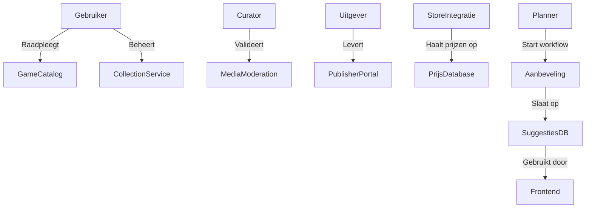

# ICT Architecture Project – Meta Gamewinkel

## 1. Inleiding

Jij en twee vrienden staan op het punt af te studeren, maar willen liever zelf iets oprichten dan te gaan solliciteren. Omdat jullie allemaal graag gamen, beslissen jullie daar iets rond te doen. Na een uitgebreide brainstorm concluderen jullie dat er ruimte is voor een "meta-winkel" waarop je games uit bestaande winkels kan terugvinden, prijzen vergelijken, je collectie beheren en browsen door een lijst met aanbevelingen.

---

## 2. Softwarekwaliteitskarakteristieken

| Karakteristiek      | Belang voor dit project                                                                         |
| ------------------- | ----------------------------------------------------------------------------------------------- |
| **Scalability**     | We willen op termijn veel gebruikers ondersteunen, zeker tijdens piekmomenten zoals sales.      |
| **Availability**    | Gebruikers willen hun collectie 24/7 kunnen raadplegen.                                         |
| **Maintainability** | API’s van externe winkels wijzigen regelmatig. Updates moeten vlot kunnen.                      |
| **Extensibility**   | Nieuwe platformen en winkels moeten gemakkelijk integreerbaar zijn.                             |
| **Performance**     | De interface moet snel games tonen en reageren.                                                 |
| **Security**        | Gebruikers koppelen accounts van externe winkels, dus privacy en veilige toegang zijn cruciaal. |

> **Driving characteristics:** Scalability, Availability, Extensibility

---

## 3. Logische Architectuur – Combinatie van Workflow en Actor/Action Approach

Voor dit systeem kiezen we voor een **combinatie** van de **actor/action approach** en de **workflow approach**. Beide bieden waardevolle inzichten in hoe het systeem functioneert, en vullen elkaar goed aan gezien de diversiteit aan gebruikersinteracties én achtergrondprocessen.

### Actor/Action Approach

Deze benadering is geschikt om de belangrijkste actoren en hun interacties met het systeem te identificeren. Denk hierbij aan:

- **Gebruiker** die games bekijkt, een collectie beheert of notificaties ontvangt.
- **Curator** die user-generated content nakijkt of promo’s goedkeurt.
- **Uitgever** die promomateriaal uploadt en data bijwerkt.
- **Externe store APIs** zoals Steam of PlayStation Store waar prijzen en games worden opgehaald.

### Workflow Approach

De workflow approach helpt om interne processen te modelleren die **niet direct door een gebruiker getriggerd worden**, zoals:

- Het automatisch ophalen van prijsgegevens op vaste tijdstippen.
- Het genereren van aanbevelingen op basis van gebruikersgedrag.
- Het verzenden van notificaties wanneer een game in prijs is gedaald.

Deze workflows bestaan vaak uit meerdere services of stappen en verlopen deels asynchroon. Daarom is deze benadering complementair aan de actor/action-view.

### Visualisatie

---

### Architecturale Benaderingen

Hoewel in een realistisch project meestal gekozen wordt voor één architecturale benadering, vereist deze opdracht het uitwerken van zowel een **monolithische** als een **microservices**-implementatie. Dit laat toe om mijn inzicht in verschillende architectuurstijlen en hun respectievelijke voor- en nadelen grondig te demonstreren.

Het is bovendien niet ongebruikelijk dat er in de praktijk meerdere **proofs-of-concept** ontwikkeld worden alvorens een definitieve architecturale richting te kiezen. Door beide benaderingen uit te werken, kan ik niet alleen aantonen dat ik de verschillen begrijp, maar ook verantwoorde keuzes maken afhankelijk van de context van het project.

In dit document beschrijf ik:

- Een **monolithische implementatie**, inclusief de gekozen architecturale stijl, de motivering voor deze keuze en een mapping van de logische componenten op de fysieke structuur.
- Een **microservicesarchitectuur**, met een overzicht van de opdeling in services, bijhorende ADR's, voor- en nadelen, en een Kubernetes-proof-of-concept dat de werking van de losse componenten illustreert.

---

## Monolithische Architecturale Stijl:

### Keuze en Verantwoording

Voor de monolithische implementatie kies ik **Layered Architecture**. Deze stijl verdeelt de applicatie in duidelijke lagen met elk hun eigen verantwoordelijkheden. Typisch zijn dit:

1. **Presentation Layer** – de UI en interactie met de gebruiker
2. **Application Layer** – coördinatie van de logica
3. **Domain Layer (Business Logic)** – de kernlogica en regels
4. **Data Access Layer (DAL)** – communicatie met de databank(en)

### Waarom deze stijl geschikt is:

- **Snelle ontwikkeling voor MVP**: Omdat alles in één codebase zit en lagen logisch gescheiden zijn, is het eenvoudig om snel een werkend prototype te bouwen.
- **Overzichtelijkheid voor kleine teams**: Met een team van drie is het eenvoudiger te coördineren en overzicht te behouden in één projectstructuur.
- **Goede match met jullie proof-of-conceptfase**: Jullie willen een idee valideren, en dat lukt sneller met één deploybare unit.

---

## Microservices Architectuur: Voor- en Nadelen

### Voordelen

| Voordeel                         | Uitleg                                                                                                                         |
| -------------------------------- | ------------------------------------------------------------------------------------------------------------------------------ |
| **Schaalbaarheid per component** | Services zoals “Price Tracker” of “Recommendation Engine” kunnen onafhankelijk opgeschaald worden.                             |
| **Foutisolatie**                 | Problemen in bv. de notificatieservice hoeven de rest van het systeem niet te beïnvloeden.                                     |
| **Technologische vrijheid**      | Elk teamlid kan kiezen voor de beste technologie per service (bv. Node.js voor frontend gateway, Python voor recommendations). |
| **Snellere deploys per feature** | Je hoeft niet heel de applicatie te hercompileren en deployen.                                                                 |

### Nadelen

| Nadeel                        | Uitleg                                                                                  |
| ----------------------------- | --------------------------------------------------------------------------------------- |
| **Complexere infrastructuur** | Vereist service discovery, load balancing, API gateway, logging, monitoring en meer.    |
| **Netwerk overhead**          | Meer netwerkverkeer tussen services, wat latency kan verhogen.                          |
| **Data consistentie**         | Moeilijker om transactionele consistentie te garanderen over meerdere services.         |
| **DevOps-kennis vereist**     | Kubernetes, containerbeheer en observability tools zijn noodzakelijk.                   |
| **Langzamere ontwikkelstart** | Voor de eerste versie is het opzetten van microservices trager dan een monoliet bouwen. |
| **Meer testcomplexiteit**     | Integratietesten zijn moeilijker, want je moet meerdere services opzetten en mocken.    |

---
